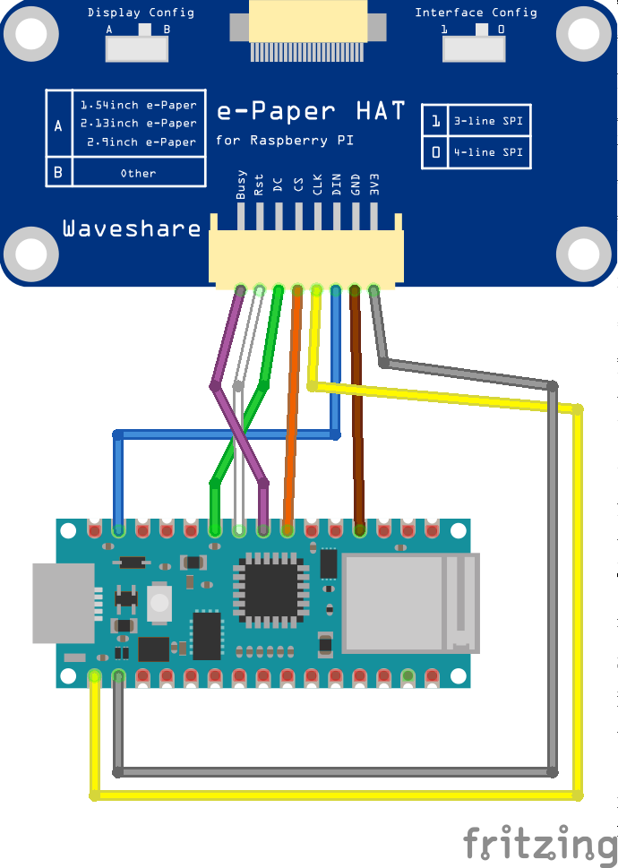
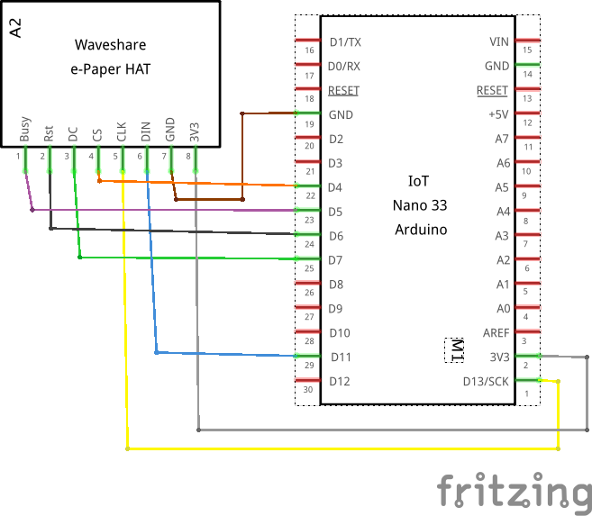

# eCal
A very low power epaper visualization of the next 2 weeks' upcoming events in a given Google Calendar using Google Apps Script, a SAMD21-based arduino (examples with Nano 33 IoT), and a WaveShare 7.5" epaper display

## Setting up
1. Create a new [App Script](https://script.google.com/) with 2 files. Use the files in "Web" folder.
2. Update calendar name in Const.gs to the calendar name that you own and want to access.
3. Deploy and give permission to access by Anyone.
4. Copy the script URL and update in the Arduino "wifi_secret.h" file.
5. Import CustomGFXFonts as a library to your Arduino environment.
6. Upload files to Arduino.

## Connections
Here is the sample connection for the Arduino Nano 33 IoT. You can use other SAMD variants with Wifi, but will need to update libraries and all appropriately. 

